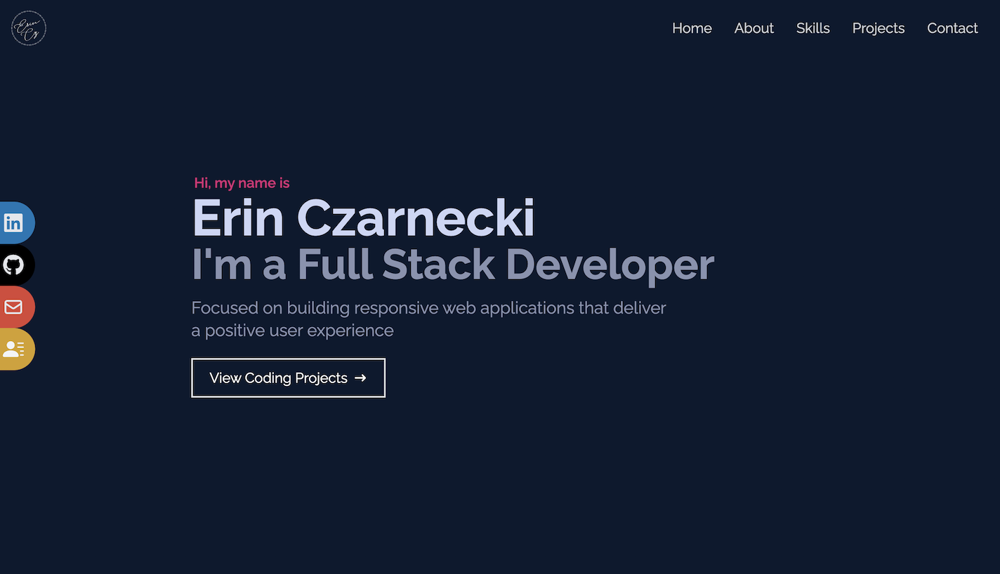
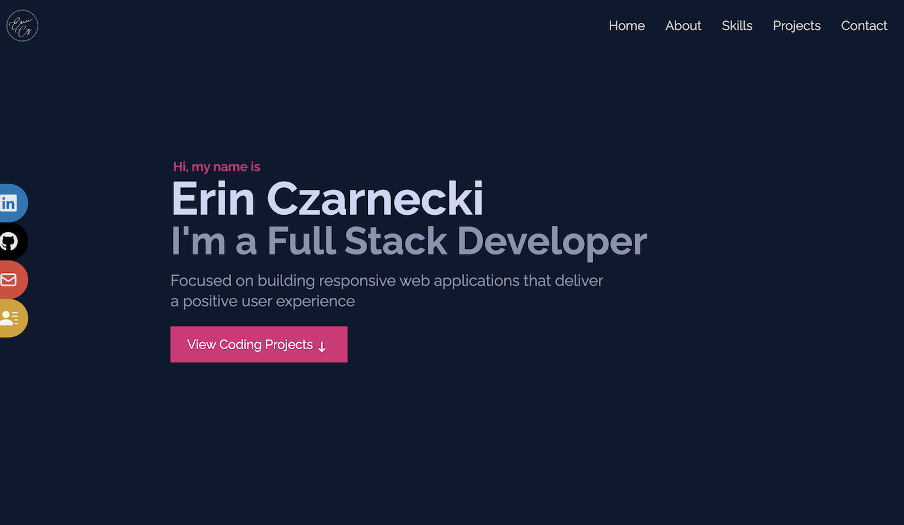
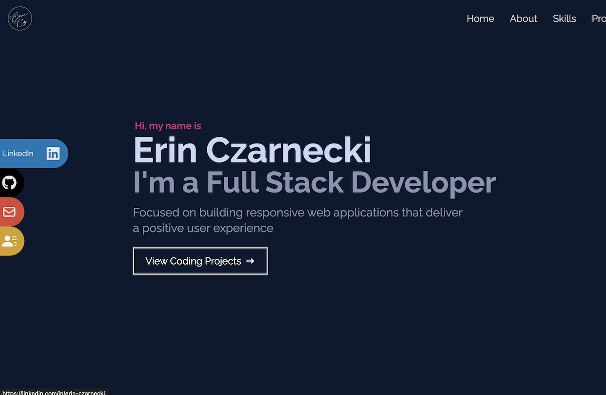
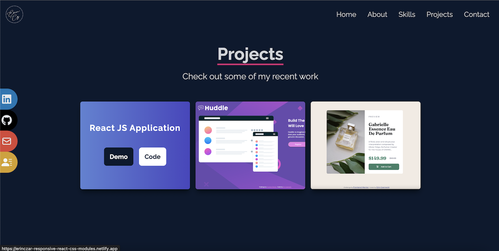
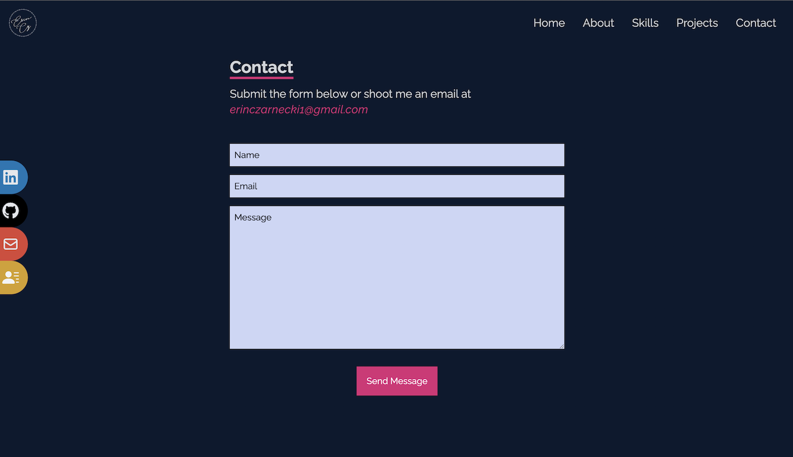
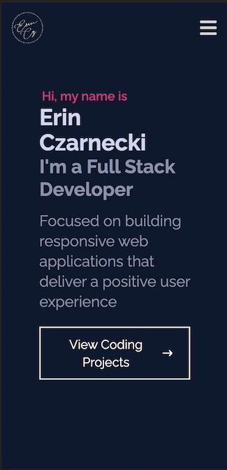
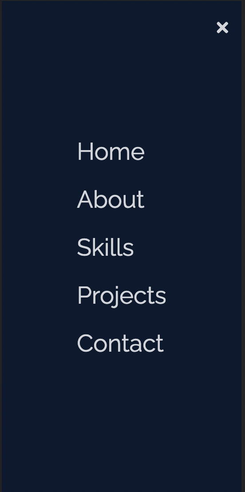
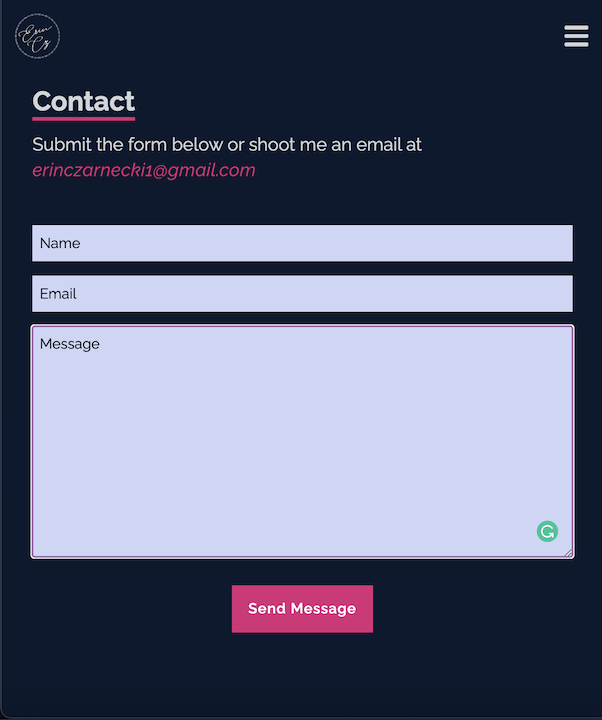

# Person Profile Portfolio  

## Table of Contents  
- [Person Profile Portfolio](#person-profile-portfolio)
  - [Table of Contents](#table-of-contents)
  - [Overview](#overview)
    - [Objectives](#objectives)
    - [Screenshots](#screenshots)
      - [**Desktop**](#desktop)
      - [**Active State**](#active-state)
      - [**Mobile**](#mobile)
    - [Links](#links)
  - [My process](#my-process)
    - [Built With](#built-with)
    - [What I Learned](#what-i-learned)
    - [**Continued Development**](#continued-development)
  - [Author](#author)

***
***
## Overview
A single-page-application built to showcase skills, past experience, and provide contact options. Use GitHub and Netlify to store/host website for low-cost solution.  
***

### Objectives

Users should be able to:

- Navigate easily on all screen sizes with visible and/or intuitive linking
- View the optimal layout for the page depending on their device's screen size
  - Create collapsible navigation to save space on smaller screen
  - Hide fixed side (social) links when viewing on smaller screen
- See hover states for all interactive elements on the page
- Fill out and send email through the embedded contact form
***

### Screenshots  
 
 #### **Desktop**  
  

***
#### **Active State** 
  
  
  
  
***
#### **Mobile**  
  
  
  

***
### Links

- Solution URL: [GitHub Code](https://github.com/erinczarnecki/react_portfolio_website)
- Live Site URL: [Live Site](https://erinczar-portfolio.netlify.app)  

***
***
## My process

### Built With

- React JS
- Tailwind CSS
- Semantic HTML5 markup
- CSS custom properties
- Flexbox
  
***

### What I Learned

- I used this project to explore TailwindCSS and imporve my React JS knowledge. I enjoyed being able to use the styling inside the JSX components, but I think there is room for improvement (especially in regards to DRY coding).  
- TailwindCSS uses a mobile first breakpoint system, and I struggled to create a medium/tablet screen layout that made use of the larger screen without compromising the component visibility.  
- If I were to start this project over...  
  -  I would try to wireframe 3 distinct layouts from the beginning rather than try to merge aspects of the small/large on-the-spot. 
  - The application feels a bit overloaded with information, so I think I would start with a MPA module from the beginning and build out components on their own pages 

  
***
  

### **Continued Development**

- In the future, I would like to reformat this from a SPA to Multi-Page-Application where I can add greater detail to the projects and contact options. 
- Apart from this project, I would like to take the skills I've learned to recreate some static sites/pages with React
- Next I would like to continue improving my React skills by learning [React Native](https://reactnative.dev/)

  
***
***
## Author

- Website - [Erin Czarnecki](https://www.your-site.com)
- Frontend Mentor - [@erinczar](https://www.frontendmentor.io/profile/erinczar)
- GitHub - [@erinczarnecki](https://github.com/erinczarnecki)
- [LinkedIn](https://linkedin.com/in/erin-czarnecki)
